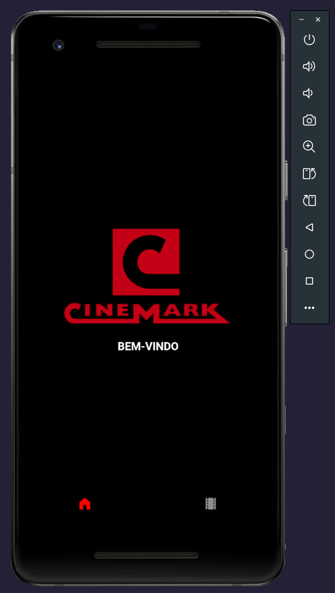

<h1 style="color:red">CINEMARK</h1>

<h4>OBJETIVO</h4>
📌 O desenvolvimento foi realizado com o objetivo de estudo para aprimorar as habilidades com react native

<h4>⭐ FEATURES</h4>

<ul>
  <li>Splash Screen</li>
  <li>PI Request (axios</li>
  <li>Modal</li>
</ul>

<h4>📱 UI</h4>

> HOME SCREEN
>  

> MOVIES SCREEN
> >  

> MODAL (SINOPSE)
> >  

